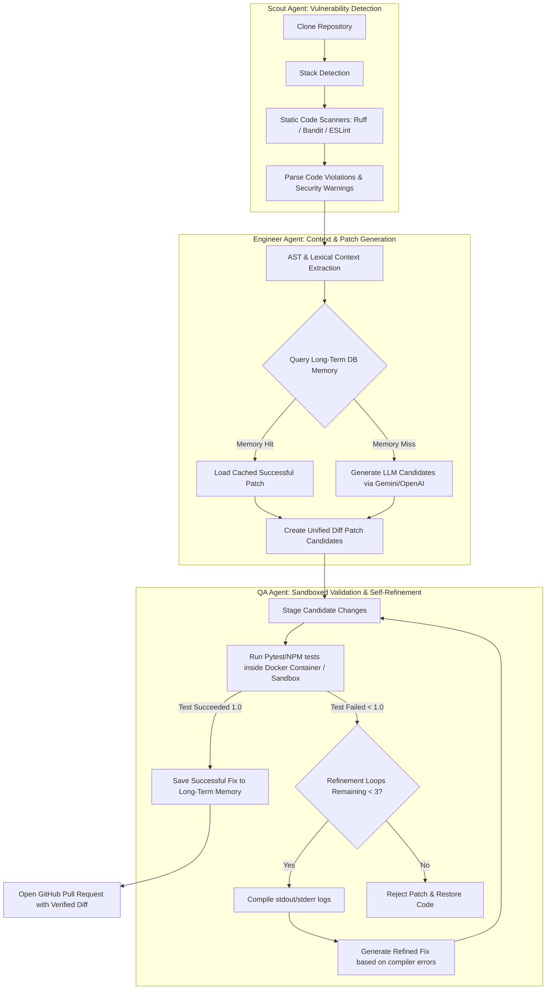
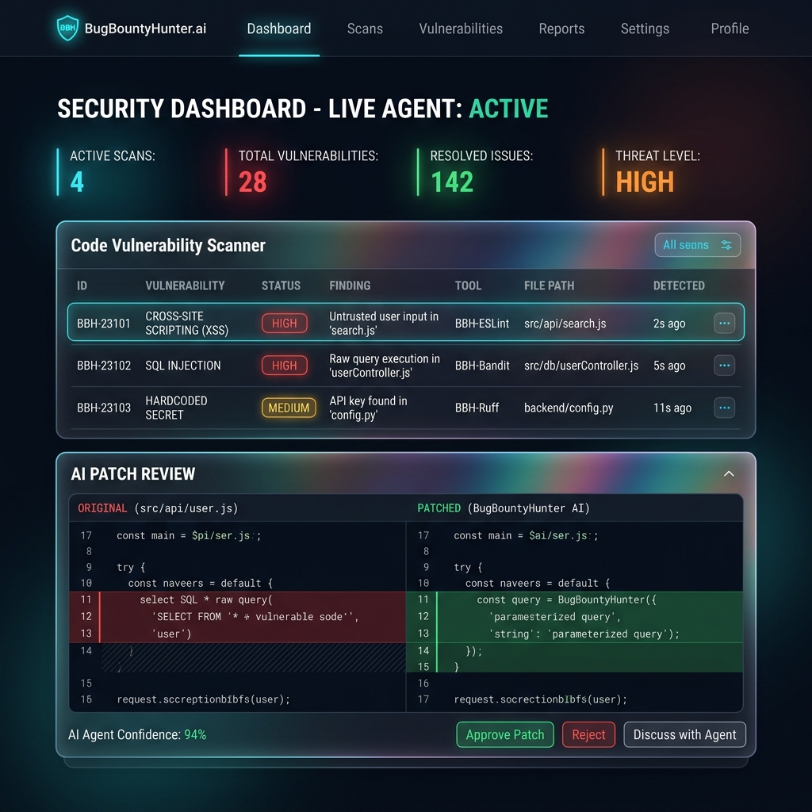

# 🎯 BugBountyHunter.ai
> **An Autonomous Multi-Agent Security System that dynamically scans codebases, detects vulnerabilities, and executes containerized self-refining repairs.**

[](https://github.com/Naksh2407/BugBountyHunter.ai/actions/workflows/test.yml)
[](https://modelcontextprotocol.io)
[](https://ai.google.dev/)

Built for the next generation of automated software security, **BugBountyHunter.ai** acts as an autonomous agent that not only scans your code for linter errors, styling violations, and security vulnerabilities, but also validates generated patches in sandboxed runners, refines them recursively based on compiler logs, and automatically stages verified pull requests.

---

## 🤖 Agentic Architecture & Workflows

BugBountyHunter is designed around a cooperative **Multi-Agent Architecture** where specialized agents collaborate to analyze, repair, and test code:



### 1. 🔍 The Scout Agent (Detection)
* **Role:** Detects files, locates syntax errors, linting issues, and security vulnerabilities.
* **Tools:** Dynamically runs Python's **Ruff**, **Bandit**, and **mypy**, or Javascript's **ESLint**.
* **Source:** Implemented in [scan_agent.py](file:///c:/Users/AGOEL/OneDrive/Desktop/BugBountyHunter.ai/apps/api/app/agents/scan_agent.py) and [analysis_agent.py](file:///c:/Users/AGOEL/OneDrive/Desktop/BugBountyHunter.ai/apps/api/app/agents/analysis_agent.py).

### 2. 🛠️ The Engineer Agent (Patching)
* **Role:** Analyzes the target block and writes candidate repairs.
* **Details:**
  * **AST Context Engine:** Uses python AST parsing to find target function definitions so the LLM gets only the exact context block.
  * **Long-Term Memory:** Checks an SQLite-backed database memory to retrieve cache hits for similar previously resolved bugs.
* **Source:** Implemented in [repair_agent.py](file:///c:/Users/AGOEL/OneDrive/Desktop/BugBountyHunter.ai/apps/api/app/agents/repair_agent.py) and [context_agent.py](file:///c:/Users/AGOEL/OneDrive/Desktop/BugBountyHunter.ai/apps/api/app/agents/context_agent.py).

### 3. 🧪 The QA Agent (Sandbox Execution & Reflection)
* **Role:** Sandboxes code execution and performs iterative self-refinement.
* **Details:**
  * **Sandboxing:** Isolates test execution in a secure Docker container, falling back to local subprocesses if docker is unavailable.
  * **Self-Refinement Loop:** Runs up to 3 recursive prompt reflection cycles. If test runners fail, compiler errors (`stdout` / `stderr`) are fed back into the context so the LLM dynamically refines its patch.
* **Source:** Implemented in [validation_agent.py](file:///c:/Users/AGOEL/OneDrive/Desktop/BugBountyHunter.ai/apps/api/app/agents/validation_agent.py).

---

## 🌟 Premium Features
* **Google Gemini & OpenAI Support:** Full native support for the new Google **Gemini 2.5/1.5** models via the OpenAI-compatible Gemini API wrapper.
* **Model Context Protocol (MCP) Server:** Fully compatible **stdio-based MCP Server** allowing direct interoperability with agents inside **Cursor** or **Claude Desktop**.
* **Glassmorphic Interactive UI:** High-fidelity dashboard built with glassmorphic overlays, slide-in details drawers, and real-time Celery scanning indicators.
* **CI/CD Integration:** Integrates out of the box with GitHub Actions workflow checks.

---

## 📂 Project Architecture

```text
BUG APP/
├── .github/workflows/
│   └── test.yml              # GitHub Actions QA Verify Workflow
├── apps/
│   └── api/                  # Python FastAPI Backend & Dashboard
│       ├── app/
│       │   ├── agents/       # Scout, Engineer, & QA Agent classes
│       │   ├── api/          # Route handlers & dashboard HTML templates
│       │   ├── core/         # DB connection setup & configurations
│       │   ├── models/       # Database schemas (SQLite / PostgreSQL)
│       │   ├── services/     # GitHub integrations, Report generation, & LLM configuration
│       │   └── workers/      # Celery task schedule & execution engines
│       ├── requirements.txt  # Python requirements (fastapi, celery, gitpython, openai, docker)
│       └── .env              # Local credentials (DATABASE_URL, GITHUB_TOKEN)
├── docker/
│   └── docker-compose.yml    # Redis broker configuration service
├── scratch/                  # Temporary clone directory for scanning/verifying codebases
└── README.md                 # Project presentation documentation
```

---

## 🚀 Quickstart & Setup

### 1. Prerequisites
* Python 3.10+
* Docker (for sandbox container tests)
* Redis (optional, falls back to Celery Eager SQLite if Redis is offline)

### 2. Launching the Backend API & Dashboard
1. Navigate to the `apps/api` directory:
   ```bash
   cd apps/api
   ```
2. Activate your virtual environment and install dependencies:
   ```bash
   .venv\Scripts\activate
   pip install -r requirements.txt
   ```
3. Start the FastAPI dashboard server:
   ```bash
   python -m uvicorn app.main:app --port 8000 --host 127.0.0.1
   ```
4. Open your browser and navigate to the dashboard portal:
   ```
   http://127.0.0.1:8000/dashboard
   ```

---

## 🤖 Interoperability & Integration (MCP Server & Gemini)

### 1. Google Gemini Support
To run the agent using Gemini models (e.g., `gemini-2.5-flash`):
1. Set the environment variable:
   ```bash
   # Windows Command Prompt
   set GEMINI_API_KEY=your_gemini_api_key_here
   # Windows PowerShell
   $env:GEMINI_API_KEY="your_gemini_api_key_here"
   ```
2. (Optional) Customize the target model:
   ```bash
   set GEMINI_MODEL=gemini-2.5-flash
   ```
3. If `GEMINI_API_KEY` is not configured, the agent automatically falls back to `OPENAI_API_KEY` or Mock local developer fallback mode.

### 2. Stdio-based MCP Server for Claude Desktop/Cursor
BugBountyHunter exposes a fully compliant `stdio` Model Context Protocol (MCP) server. You can integrate this agent directly into tools like Claude Desktop or Cursor to allow them to scan, repair, and validate your codebases.

#### Claude Desktop Configuration
Add the following configuration to your `claude_desktop_config.json` (located at `%APPDATA%\Claude\claude_desktop_config.json` on Windows):
```json
{
  "mcpServers": {
    "bug-bounty-hunter": {
      "command": "python",
      "args": ["-m", "app.mcp_server"],
      "env": {
        "GEMINI_API_KEY": "your_gemini_api_key_here",
        "GITHUB_TOKEN": "your_github_token_here"
      },
      "cwd": "c:/Users/AGOEL/OneDrive/Desktop/BugBountyHunter.ai/apps/api"
    }
  }
}
```
Now, you can interact with `BugBountyHunter` from Claude Desktop to initiate scans, run code repairs, or execute sandboxed tests.

---

## 🎥 Dashboard Preview
Below is a preview of the high-fidelity glassmorphic dashboard of **BugBountyHunter.ai** displaying real-time security vulnerabilities, static scan outcomes, and self-refining patch diff corrections:



